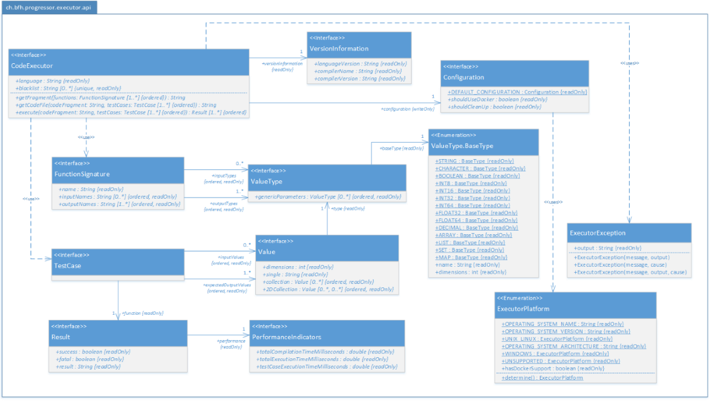
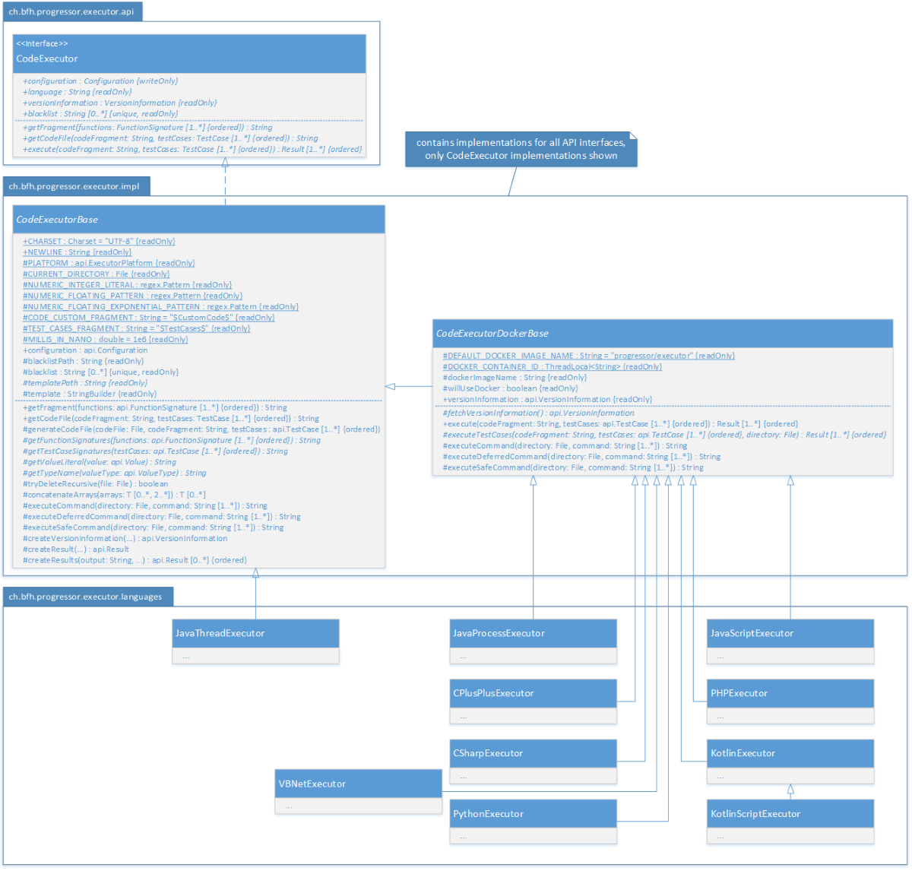

# Progressor - Executor

This is the code of the **Executor** component of the project [**Progressor - The Programming Professor**](https://github.com/Progressor/ProgressorMeteor).

## Deployment & Installation

These instructions are written for *Ubuntu* 16.04 LTS.

The goal is to install the **Executor** in `/opt/Executor/` and run it as a Docker container.

### Server Setup

1. Install [*Docker*](https://www.docker.com/) by executing `curl -sSL https://get.docker.com/ | sh`
1. Install [*OpenJDK*](http://openjdk.java.net/) and [*Supervisor*](http://supervisord.org/) by executing `sudo apt-get install -y openjdk-8-jre-headless supervisor`
    * You may use any other *Java Runtime Environment* instead.
1. Configure *Supervisor* to start the **Executor** automatically:
    1. Set up *Supervisor* web admin interface with the username/password of your choice: `sudo nano /etc/supervisor/supervisord.conf`

        ```ini
        [inet_http_server]
        port = 9001
        username = your-supervisor-username
        password = your-supervisor-password
        ```

    1. With `sudo nano /etc/supervisor/conf.d/progressor-executor.conf`, create a supervisor service configuration, with the following content:

        ```ini
        [program:executor]
        command=java -jar /opt/Executor/ProgressorExecutor.jar
        autostart=true
        autorestart=true
        environment=KOTLIN_HOME="/kotlinc"
        ```

       * If you need to override the default settings, please refer to the detailed [configuration information](doc/ExecutorConfig.md).

    1. Make *Supervisor* start when the server boots: `sudo systemctl enable supervisor`
    1. Start the service by executing `sudo service supervisor start`
    1. Reload *Supervisor* configuration by running `sudo supervisorctl reread`
    1. and `sudo supervisorctl update`

### Uploading the Executor JAR and Building the Docker Image

1. If you built the **Executor** *JAR* from this repo, rename it to `ProgressorExecutor.jar` and upload it to your server in `/opt/Executor/`, otherwise download the pre-compiled one:
    1. `cd /opt/Executor/`
    1. `wget https://github.com/Progressor/ProgressorMeteor/raw/master/bin/ProgressorExecutor.jar`
1. If you modified the [*Dockerfile*](src/main/docker/Dockerfile), upload it to your server in `/opt/Executor/`, otherwise download the pre-compiled one:
    1. `cd /opt/Executor`
    1. `wget https://raw.githubusercontent.com/Progressor/ProgressorExecutor/master/src/main/docker/Dockerfile`
1. On the server, still in `/opt/Executor`, build the *Docker* image used by the **Executor** by running `docker build -t progressor/executor .`

The **Executor** will use this image to create one container per request.
After the request has been processed, the container is stopped and immediately deleted.

That way we make sure the different requests never interfere with each other.

### Building the Executor From Source

This repository contains a [*Maven*](https://maven.apache.org/) project created using [*IntelliJ IDEA*](https://www.jetbrains.com/idea/).

*Maven* can easily be [downloaded](https://maven.apache.org/download.cgi) and [installed](https://maven.apache.org/install.html) on any platform.
But it is also included in many IDEs like [*IntelliJ IDEA*](https://www.jetbrains.com/idea/), [*NetBeans*](https://netbeans.org/) and others.

The dependencies are outlined in a [separate document](doc/ExecutorDependencies.md).

You can build the project by executing `mvn clean package -Dmaven.test.skip=true` which will create the executable `target/ProgressorExecutor-1.0-jar-with-dependencies.jar`.

This statement will do the following:

1. It will clean the workspace and remove any files left over from previous builds.
1. It will generate *Java*-specific [*Apache Thrift*](https://thrift.apache.org/) code based on the language-independent interface definition in `src/main/thrift/executor.thrift`.
1. It will skip the tests as you may not have properly set up your development machine to test all supported programming languages.
1. It will build the application.
1. It will generate two *JAR* files: one slim version (without the dependencies included) and one with all the dependencies included which you can then copy and use wherever you like.

## Introduction

The **Executor** is a *Java* application that receives requests from the **Progressor** web application using *Apache Thrift*.

The actual application logic is completely separated from the *Apache Thrift* layer and has its own public API that can be used to [extend](doc/ExecutorConfig.md#extensibility) the **Executor**.



Additionally, the project contains two abstract classes that can be reused to easily implement a new programming language. 


